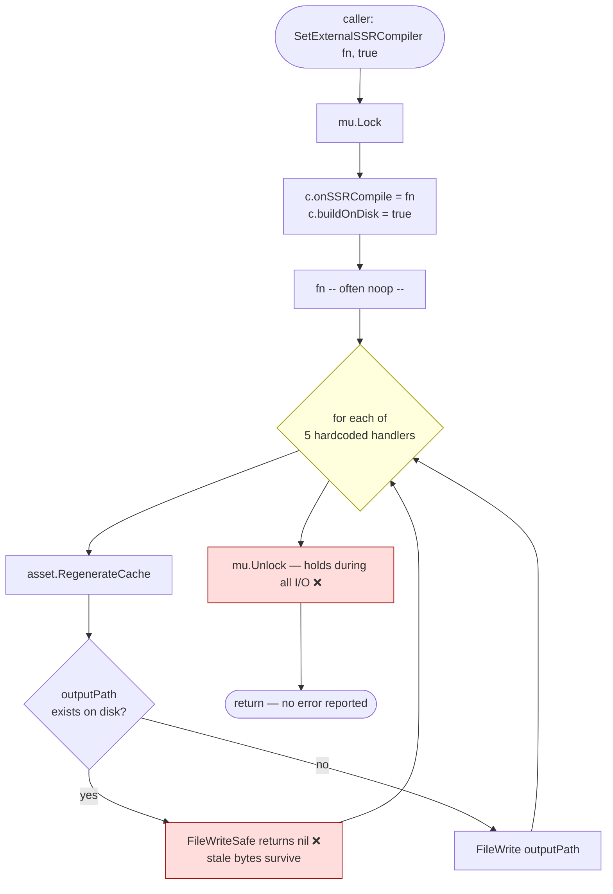
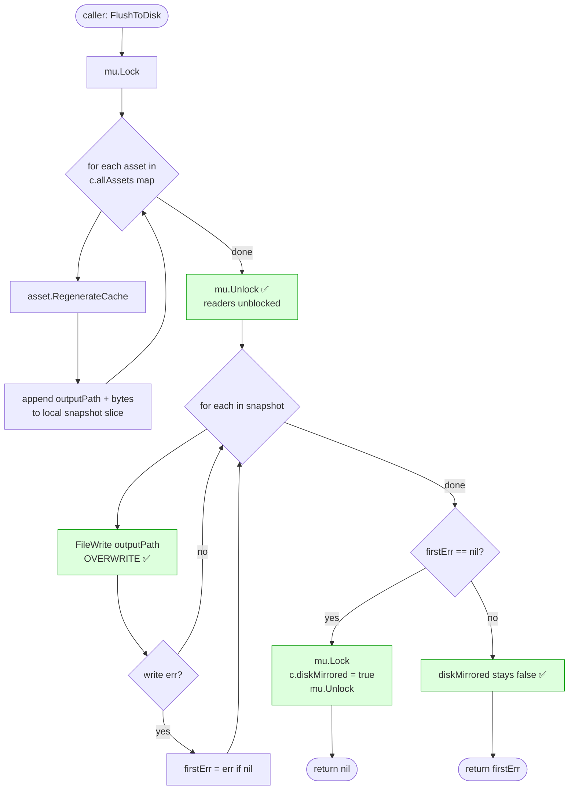
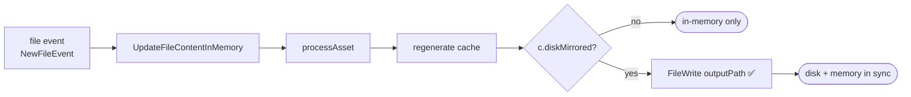
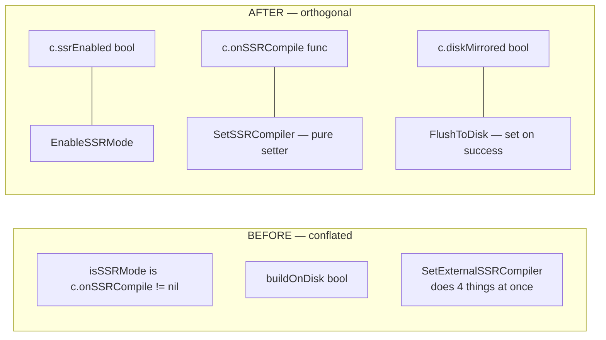
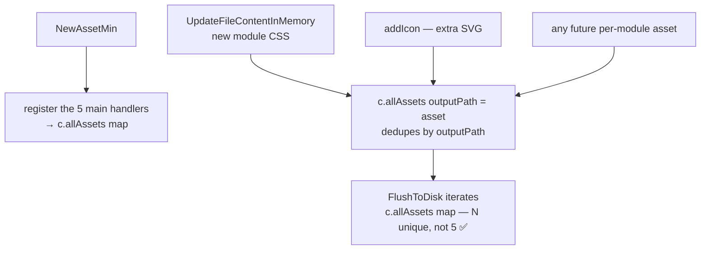

# `FlushToDisk` — flow

Companion to [assetmin/docs/PLAN.md](../PLAN.md). Cross-package view lives in
[app/docs/diagrams/EXTERNAL_MODE_TRANSITION.md](../../../app/docs/diagrams/EXTERNAL_MODE_TRANSITION.md).

## Current (buggy) flow — `SetExternalSSRCompiler(_, true)`

Defects:
- **B1** the `Skip` branch dominates in a dev session (files exist).
- **B2** loop iterates only 5 main handlers.
- **B3** API conflates SSR-mode flag, compiler registration, and disk flush.
- Lock held during all disk I/O.

## Expected (post-fix) flow — `FlushToDisk()` with snapshot-then-write

Key guarantees:
- ✅ `c.mu` is NOT held during disk I/O (no blocking of HTTP serving / watcher events).
- ✅ `c.diskMirrored` is set **only** on a fully successful flush.
- ✅ Overwrite, never `FileWriteSafe`.
- ✅ Asset set is `c.allAssets` (deduplicated map keyed by `outputPath`).

After a successful `FlushToDisk`, the per-event path mirrors to disk:

## State decoupling (B3 fix)

`isSSRMode()` returns `c.ssrEnabled` (no longer inferred from compiler nilness).
`SetSSRCompiler` is a **pure setter** — it does NOT auto-invoke the registered function.

## Asset enumeration (B2 fix)

## API surface change

| Before                                          | After                                     |
|-------------------------------------------------|-------------------------------------------|
| `SetExternalSSRCompiler(fn, buildOnDisk)`       | split into 3 single-responsibility APIs   |
| `SetBuildOnDisk(bool)` (deprecated)             | `FlushToDisk() error`                     |
| `isSSRMode = (onSSRCompile != nil)`             | `EnableSSRMode()` sets `c.ssrEnabled`     |
| compiler auto-invoked on registration           | `SetSSRCompiler(fn)` is a pure setter     |
| `buildOnDisk` field                             | `diskMirrored` (set by successful flush)  |
| `FileWriteSafe`                                 | removed; use `FileWrite`                  |
| asset set = 5 hardcoded handlers                | `c.allAssets map[string]*asset`           |
| lock held during I/O                            | snapshot-then-write (unlock before I/O)   |
