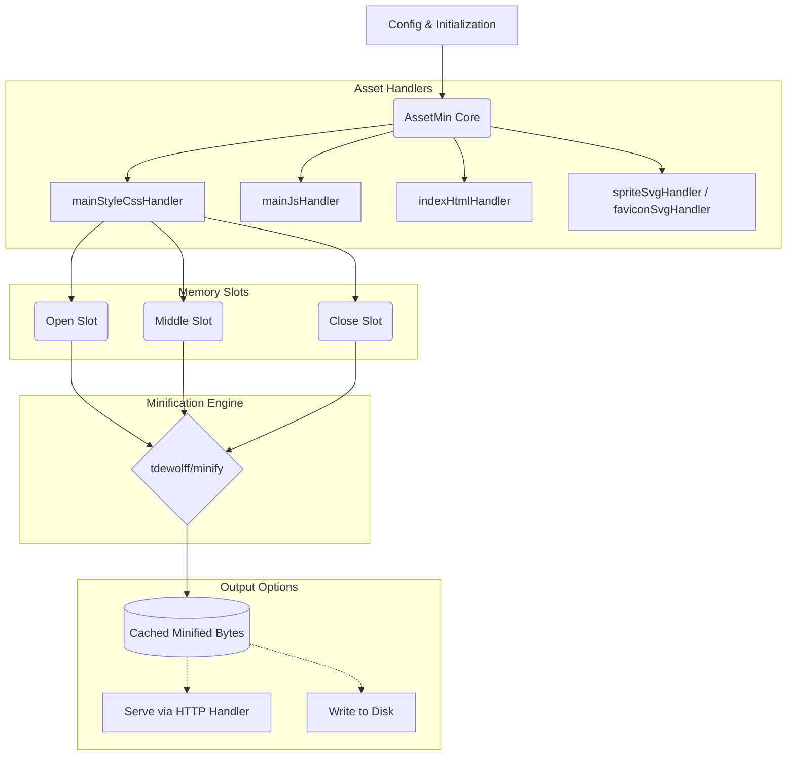

# AssetMin Architecture

This flowchart illustrates the high-level architecture of AssetMin and how its internal components interact to process, minify, and cache assets.

```mermaid
graph TD
    A[Config & Initialization] --> B(AssetMin Core)
    
    subgraph Asset Handlers
    B --> C[mainStyleCssHandler]
    B --> D[mainJsHandler]
    B --> E[indexHtmlHandler]
    B --> F[spriteSvgHandler / faviconSvgHandler]
    end
    
    subgraph Memory Slots
    C --> C1(Open Slot)
    C --> C2(Middle Slot)
    C --> C3(Close Slot)
    end
    
    subgraph Minification Engine
    C1 --> M{tdewolff/minify}
    C2 --> M
    C3 --> M
    end
    
    M --> Z[(Cached Minified Bytes)]
    
    subgraph Output Options
    Z -.-> HTTP[Serve via HTTP Handler]
    Z -.-> Disk[Write to Disk]
    end
```
