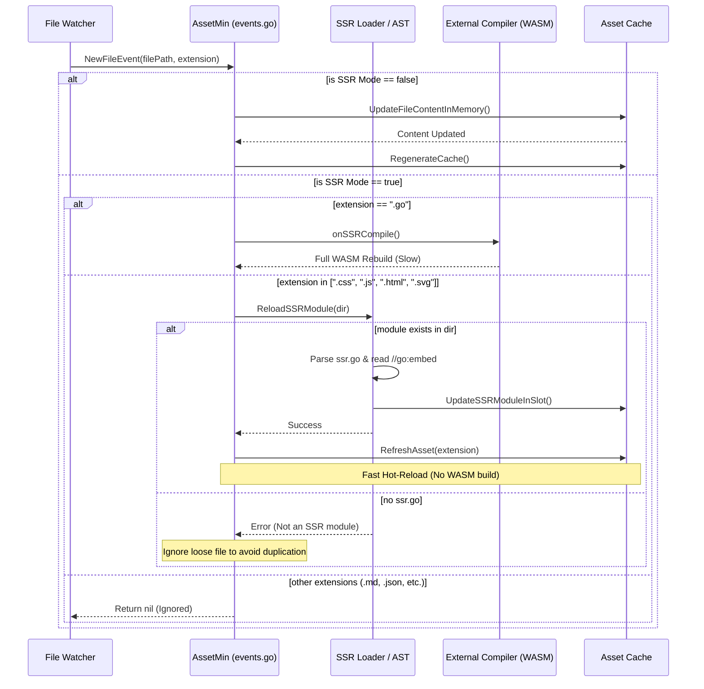

# Event Flow & Hot-Reload Sequence

This sequence diagram explains how `AssetMin` processes file events during development. It specifically highlights the dual-path SSR hot-reloading mechanism, which avoids expensive WASM rebuilds when editing embedded assets.

